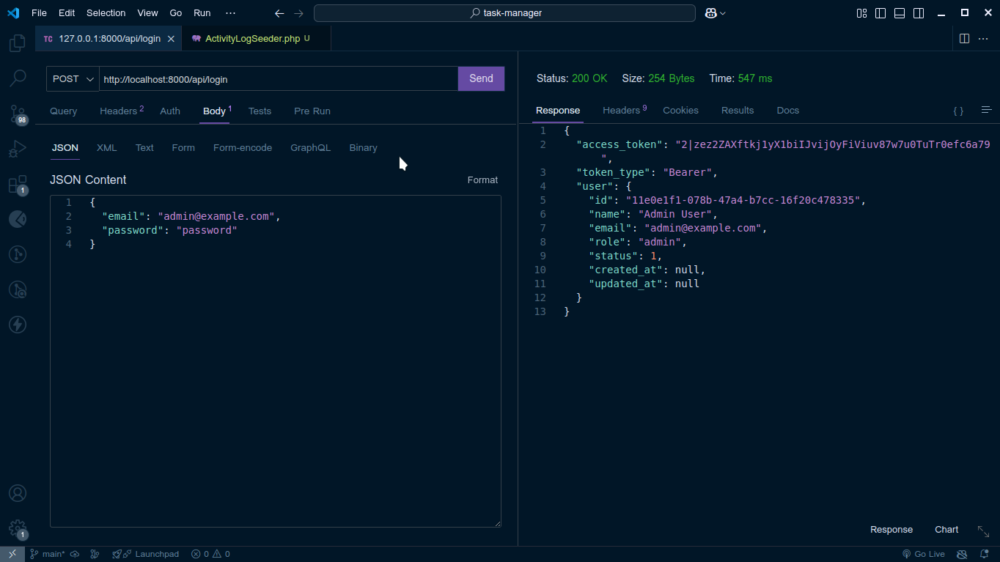
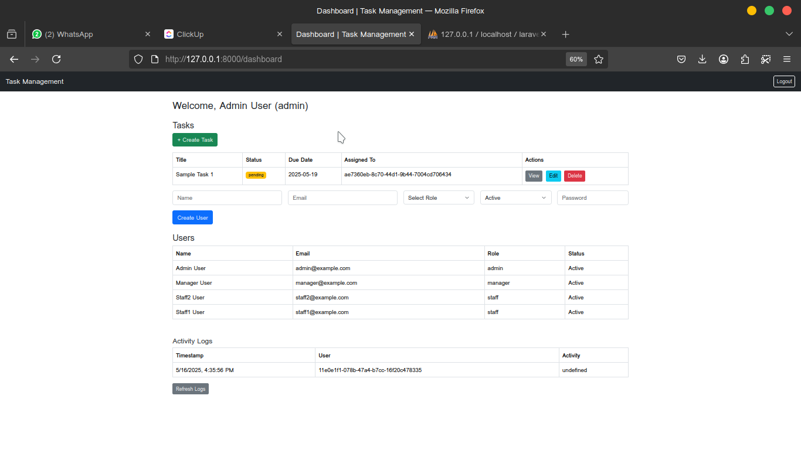
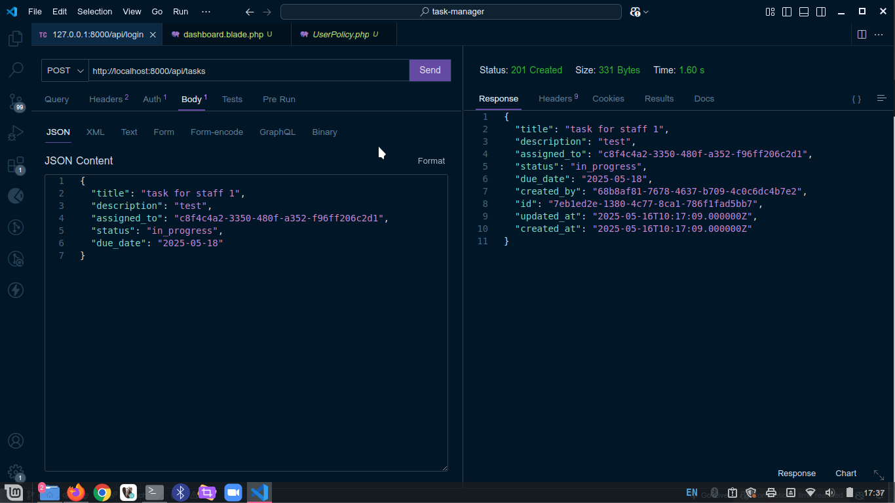
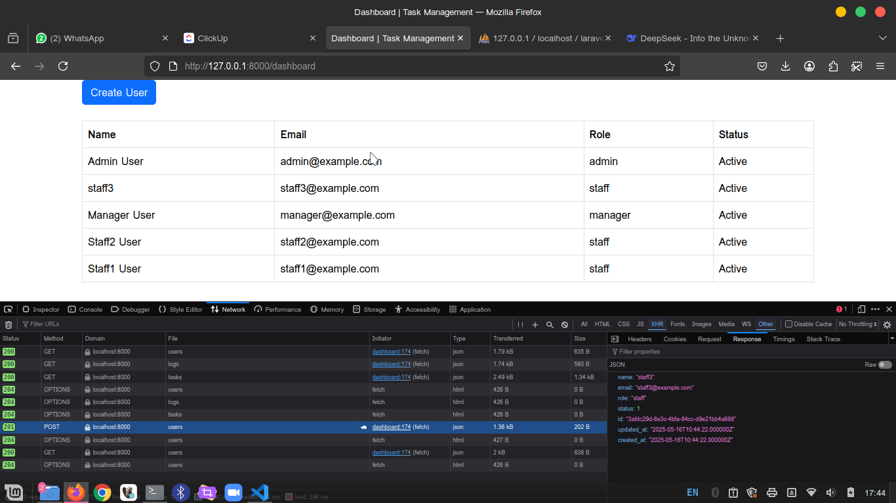
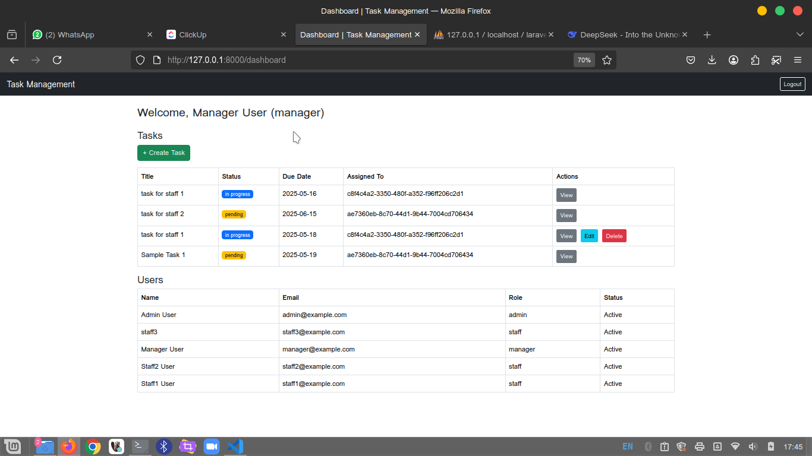
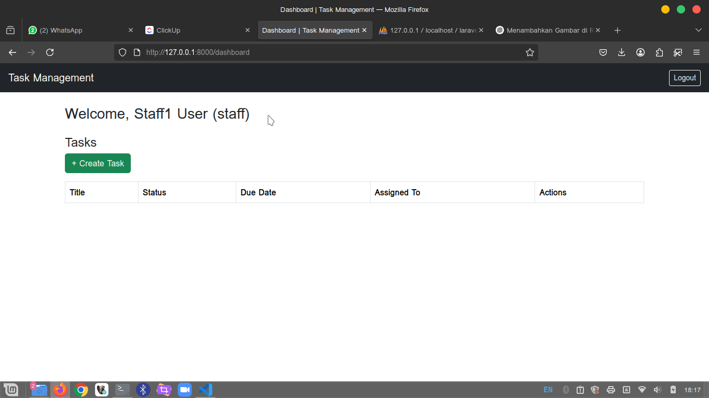
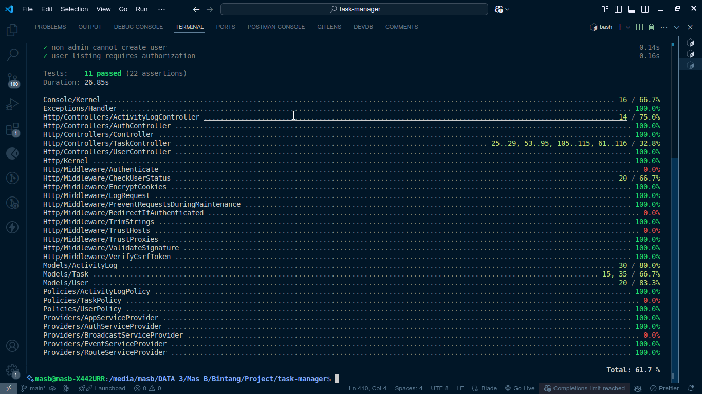

# Manajemen User & Task API (Laravel 10 + Vanilla JS)

Sistem RESTful API untuk manajemen **User**, **Task**, dan **Activity Log** dengan role-based access control, validasi bisnis, dan batch logic.

## 📦 Fitur

-   🔐 Login berbasis Sanctum + middleware `checkUserStatus`
-   👤 Role: `admin`, `manager`, `staff`
-   📝 Task assignment dengan logika peran
-   📄 Auto-log task overdue (tanpa scheduler)
-   📊 Activity log tiap aksi penting
-   ✅ Unit & Feature Test

## 🧰 Tech Stack

-   Laravel 10+
-   Sanctum (API auth)
-   UUID as primary key
-   Vanilla JS (frontend nanti)
-   Bootstrap (optional UI)

---

## 🛠️ Instalasi

```bash
git clone <repo-url>
cd <project>
composer install
cp .env.example .env
php artisan key:generate
php artisan migrate --seed
php artisan serve
```

---

## 🔑 Login

```http
POST /api/login
{
  "email": "admin@example.com",
  "password": "password"
}
```

Token dikembalikan → gunakan untuk Auth Header:

```http
Authorization: Bearer <token>
```

---

## 🧪 **Payload JSON** untuk Testing API

### 🔐 Login

```json
POST /api/login
{
  "email": "admin@example.com",
  "password": "password"
}
```

### 🧑‍💻 Create Task

```json
POST /api/tasks
{
  "title": "Membuat Laporan",
  "description": "Laporan akhir tahun",
  "assigned_to": "UUID_STAFF",
  "status": "pending",
  "due_date": "2025-05-20"
}
```

---

## 📘 Endpoint API

| Endpoint           | Role           | Keterangan                |
| ------------------ | -------------- | ------------------------- |
| POST /login        | Semua          | Login via Sanctum         |
| GET /users         | Admin, Manager | Lihat semua user          |
| POST /users        | Admin          | Buat user baru            |
| GET /tasks         | Semua          | Lihat task sesuai role    |
| POST /tasks        | Sesuai role    | Buat task dengan validasi |
| PUT /tasks/{id}    | Admin/Creator  | Edit task                 |
| DELETE /tasks/{id} | Admin/Creator  | Hapus task                |
| GET /logs          | Admin only     | Lihat seluruh aktivitas   |

---

## 👤 Role Akses

| Role    | View Users | Manage Tasks | Assign Tasks  | View Logs |
| ------- | ---------- | ------------ | ------------- | --------- |
| Admin   | ✅         | ✅           | ✅            | ✅        |
| Manager | ✅ (team)  | ✅ (team)    | ✅ (to staff) | ❌        |
| Staff   | ❌         | ✅ (own)     | ❌            | ❌        |

## Screenshot








